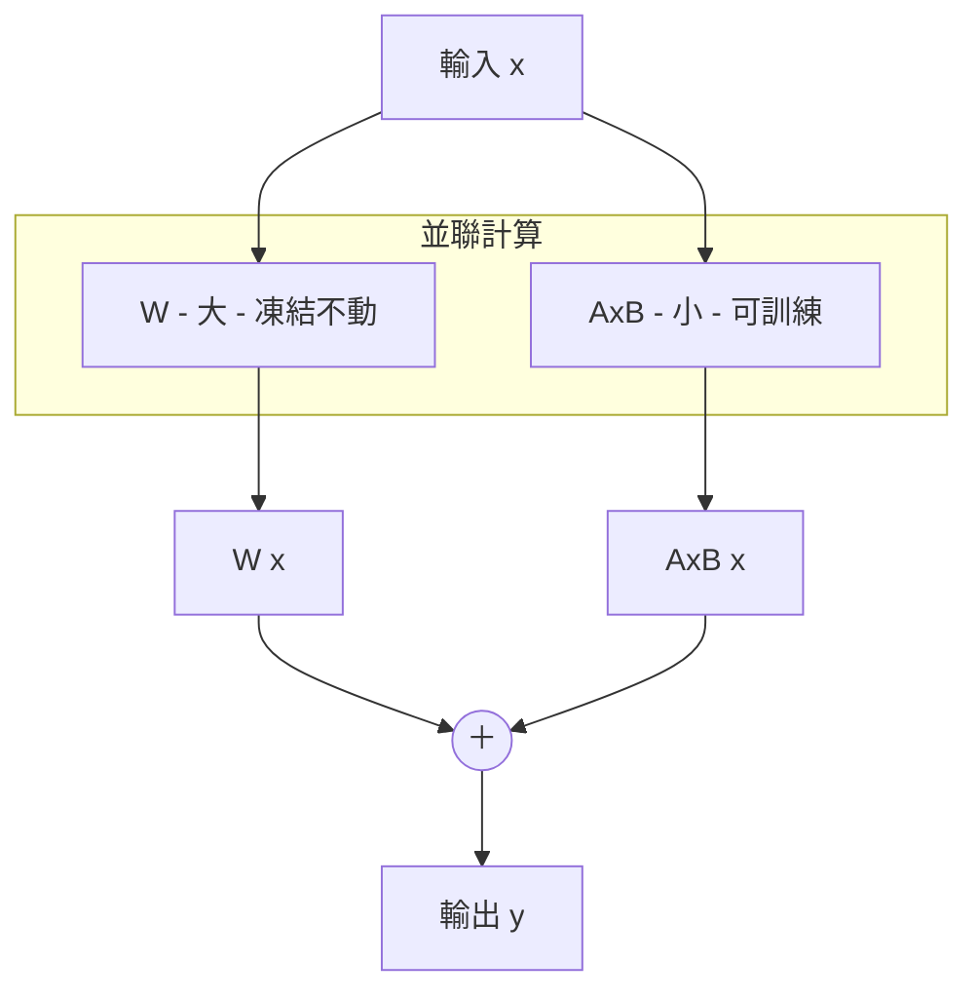
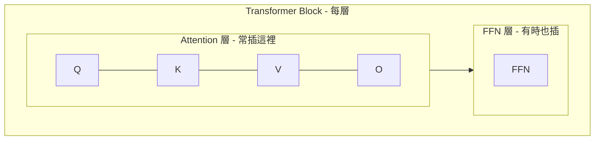

# Ollama 學習筆記

## 常用指令

| 指令 | 說明 |
|------|------|
| `ollama list` | 列出本機所有模型 |
| `ollama ps` | 查看目前執行中的模型（含記憶體佔用） |
| `ollama run <model>` | 執行模型進入對話 |
| `ollama pull <model>` | 下載模型 |
| `ollama rm <model>` | 刪除模型 |
| `ollama show <model>` | 顯示模型詳細資訊（含 Modelfile） |
| `ollama cp <src> <dst>` | 複製模型 |
| `ollama create <name> -f <Modelfile>` | 從 Modelfile 建立模型 |

### 對話中指令

| 指令 | 說明 |
|------|------|
| `/save <name>` | 儲存目前狀態為新模型 |
| `/show info` | 顯示模型資訊 |
| `/set parameter <name> <value>` | 臨時修改參數 |
| `/clear` | 清除對話歷史 |
| `/bye` | 離開對話 |

---

## Modelfile（模型設定檔）

用於定義自訂模型，可包含 system prompt、參數設定等。

### 基本結構

```dockerfile
# 指定基底模型
FROM llama3

# 設定 system prompt
SYSTEM """
你是一個專業的程式助手，請用繁體中文回答。
"""

# 調整參數
PARAMETER temperature 0.7
PARAMETER top_p 0.9
PARAMETER num_ctx 4096
```

### 常用 PARAMETER 參數

| 參數 | 說明 | 預設值 |
|------|------|--------|
| `temperature` | 創意度（越高越隨機） | 0.8 |
| `top_p` | 取樣範圍 | 0.9 |
| `top_k` | 取樣候選數 | 40 |
| `num_ctx` | 上下文長度 | 2048 |
| `repeat_penalty` | 重複懲罰 | 1.1 |

### 建立自訂模型

```bash
# 從 Modelfile 建立模型
ollama create my-assistant -f ./Modelfile
# transferring model data
# creating model layer
# writing manifest
# success

# 驗證
ollama list
# NAME              ID            SIZE      MODIFIED
# my-assistant      a]b2c3d4e5    4.7 GB    just now
# llama3            f6g7h8i9j0    4.7 GB    2 days ago

# 執行
ollama run my-assistant
# >>> 輸入訊息開始對話...
```

---

## 儲存對話為新模型

另一種建立自訂模型的方式：在對話中直接儲存。

```bash
# 進入對話
ollama run llama3
# >>>

# 設定 system prompt 或對話後，使用 /save 儲存
>>> /save my-custom-model
# Created new model 'my-custom-model'

# 驗證
ollama list
# NAME              ID            SIZE      MODIFIED
# my-custom-model   x1y2z3a4b5    4.7 GB    just now
# llama3            f6g7h8i9j0    4.7 GB    2 days ago

# 之後可直接使用
ollama run my-custom-model
# >>> 輸入訊息開始對話...
```

---

## RAG 應用

Modelfile 可搭配 RAG（檢索增強生成）使用，透過 SYSTEM prompt 定義檢索行為。

### RAG 用 Modelfile 範例

```dockerfile
FROM llama3

SYSTEM """
你是一個知識庫助手。請根據提供的上下文資料回答問題。
規則：
1. 只使用提供的資料回答
2. 如果資料中沒有相關內容，請誠實說明「資料中未提及」
3. 回答時引用資料來源
"""

PARAMETER temperature 0.3
PARAMETER top_p 0.9
```

---

## 模型大小計算

### 參數量（B = Billion）

模型名稱中的 `7b`、`8b`、`13b`、`70b` 代表參數量（十億）。

### 計算公式

```
模型大小 = 參數量(B) × 每參數位元組數
```

### 精度對應位元組數

| 精度 | 每參數位元組數 | 說明 |
|------|----------------|------|
| FP32 | 4 bytes | 全精度浮點數 |
| FP16 / BF16 | 2 bytes | 半精度浮點數 |
| INT8 (Q8) | 1 byte | 8-bit 量化 |
| INT4 (Q4) | 0.5 byte | 4-bit 量化 |

> **為什麼大部分模型都用 FP16？**
> 根據研究指出，FP16 相較於 FP32，模型效能損失的幅度非常小（約 0.01%），但可以換來成倍的推理速度和減半的模型體積。這也是目前大部分模型主要都提供 FP16 的原因。

### FP16 vs BF16

**BF16 = Brain Floating Point 16**，由 Google Brain 團隊開發。

| 格式 | 結構 | 特點 |
|------|------|------|
| FP32 | 1 符號 + 8 指數 + 23 尾數 | 全精度 |
| FP16 | 1 符號 + 5 指數 + 10 尾數 | 精度較高，動態範圍較小 |
| BF16 | 1 符號 + 8 指數 + 7 尾數 | 精度較低，動態範圍與 FP32 相同 |

BF16 保留了 FP32 的指數位數，數值範圍一樣大，訓練時不容易溢出(更穩定)，但精度比 FP16 低。

### MXFP4（Microscaling FP4）

由 Microsoft、NVIDIA、ARM、Intel 等大廠聯合推出的 4-bit 浮點格式（OCP 標準）。

**與 INT4 的差異：**

| 格式 | 類型 | 結構 | 特點 |
|------|------|------|------|
| INT4 | 整數 | 4-bit 整數 | 範圍固定，簡單 |
| MXFP4 | 浮點 | 1 符號 + 2 指數 + 1 尾數 | 動態範圍更大 |

**MXFP4 的關鍵：Block Scaling（塊級縮放）**

```
傳統：每個數值獨立存指數
MXFP4：一組數值（如 32 個）共享一個 8-bit scale

┌─────────────────────────────────┐
│ 32 個 4-bit 數值 │ 1 個 8-bit scale │  ← 共享縮放因子
└─────────────────────────────────┘
```

**優點：**
- 比 INT4 保留更多精度（浮點 vs 整數）
- 比傳統 FP4 更省空間（共享 scale）
- 新硬體（NVIDIA Blackwell 等）原生支援

**精度比較：**

| 格式 | 相對 FP16 精度損失 | 體積 |
|------|-------------------|------|
| FP16 | 基準 | 2 bytes |
| INT8 | ~0.5% | 1 byte |
| INT4 | ~5-10% | 0.5 byte |
| MXFP4 | ~1-3% | ~0.5 byte |

> MXFP4 用 INT4 的體積，達到接近 INT8 的精度。

**未來趨勢預測：**

```
現在主流          過渡期            未來
FP16 / INT8  →  INT4 / Q4_K_M  →  MXFP4
```

等硬體普及（NVIDIA Blackwell、下一代 AMD/Intel），Ollama 上應該會開始出現 MXFP4 量化的模型。

### 模型大小換算表

| 參數量 | FP32 (×4) | FP16 (×2) | INT8 (×1) | INT4 (×0.5) |
|--------|-----------|-----------|-----------|-------------|
| **7B** | 7 × 4 = **28 GB** | 7 × 2 = **14 GB** | 7 × 1 = **7 GB** | 7 × 0.5 = **3.5 GB** |
| **8B** | 8 × 4 = **32 GB** | 8 × 2 = **16 GB** | 8 × 1 = **8 GB** | 8 × 0.5 = **4 GB** |
| **13B** | 13 × 4 = **52 GB** | 13 × 2 = **26 GB** | 13 × 1 = **13 GB** | 13 × 0.5 = **6.5 GB** |
| **32B** | 32 × 4 = **128 GB** | 32 × 2 = **64 GB** | 32 × 1 = **32 GB** | 32 × 0.5 = **16 GB** |
| **70B** | 70 × 4 = **280 GB** | 70 × 2 = **140 GB** | 70 × 1 = **70 GB** | 70 × 0.5 = **35 GB** |

> **注意**：實際大小會因模型架構、量化方法略有差異，上表為理論估算值。

### K-Quant 量化版本

| 版本 | 說明 |
|------|------|
| K_S | Small，體積最小，品質稍差 |
| **K_M** | **Medium，官方推薦，平衡首選** |
| K_L | Large，品質較好，體積較大 |

### 模型名稱範例

```
llama3.1:8b-instruct-q4_K_M
│       │  │         │  └─ 量化版本（K_M 推薦）
│       │  │         └──── 量化精度（q4 = 4-bit）
│       │  └────────────── 模型類型（instruct = 指令微調版）
│       └───────────────── 參數量（8B = 80億參數）
└───────────────────────── 模型名稱
```

**常見範例：**
| 名稱 | 說明 |
|------|------|
| `llama3.1:8b` | 8B 預設版本 |
| `llama3.1:8b-instruct-q4_K_M` | 8B 指令版 4-bit K_M 量化 |
| `llama3.1:70b-text-q8_0` | 70B 文字版 8-bit 量化 |
| `qwen2:7b-instruct-q4_K_M` | Qwen2 7B 指令版 4-bit K_M |

---

## 模型壓縮方法

除了量化，還有其他壓縮方式：

### 剪枝（Pruning）

把不重要的權重或神經元直接移除。

| 類型 | 做法 | 特點 |
|------|------|------|
| 非結構化 | 移除單個權重（設為 0） | 矩陣變稀疏，需特殊硬體加速 |
| 結構化 | 移除整個神經元/層 | 直接變小，一般硬體可加速 |

**流程：**
1. 訓練完整模型
2. 評估每個權重的重要性（看絕對值大小、梯度等）
3. 砍掉不重要的
4. 微調恢復精度

### 低秩近似（Low-Rank Approximation）

把大矩陣拆成兩個小矩陣相乘。

```
原始                      低秩近似
W (m × n)        ≈        A (m × r) × B (r × n)

參數量：m × n    →        m × r + r × n
```

**範例：**
- 原始：1000 × 1000 = **100 萬**參數
- 低秩（r=10）：1000×10 + 10×1000 = **2 萬**參數
- 壓縮 50 倍

> **LoRA** 就是這個概念：微調時不改原始權重 W，只訓練低秩的 A×B，參數量大幅減少。

### 蒸餾（Knowledge Distillation）

讓小模型學習大模型的輸出行為。

```
Input → 大模型（Teacher） → 輸出（含機率分布）
                              ↓
              小模型（Student）學習模仿
```

**關鍵：** 小模型不只學最終答案，還學大模型輸出的**機率分布**。例如大模型說「80% 是 A、15% 是 B、5% 是 C」，小模型學整個分布，能學到更多"知識"。

### 壓縮方法比較

| 方法 | 做法 | 優點 | 缺點 |
|------|------|------|------|
| 量化 | 降低數值精度 | 簡單直接 | 精度損失 |
| 剪枝 | 移除不重要權重 | 保留架構 | 需重新訓練 |
| 低秩近似 | 矩陣分解 | 大幅減參數 | 表達能力受限 |
| 蒸餾 | 小模型學大模型 | 效果好 | 需要訓練資源 |

---

## MoE（Mixture of Experts）

一種模型架構，推理時只激活部分「專家」網路，而非整個模型。

```
輸入 → Router（路由器）決定用哪些專家
            ↓
    ┌───┬───┬───┬───┬───┬───┬───┬───┐
    │ E1│ E2│ E3│ E4│ E5│ E6│ E7│ E8│  ← 8 個專家
    └───┴───┴───┴───┴───┴───┴───┴───┘
            ↓ 只激活 2 個
         ┌───┬───┐
         │ E2│ E5│  ← 實際運算
         └───┴───┘
            ↓
          輸出
```

**範例：Mixtral 8x7B**
- 總參數：8 × 7B = **56B**（模型檔案大小）
- 每次激活：2 × 7B = **14B**（實際推理計算量）
- 好處：用 14B 的速度，得到接近 56B 的效果

| 模型 | 總參數 | 激活參數 | 說明 |
|------|--------|----------|------|
| Mixtral 8x7B | 46.7B | ~12.9B | 每次激活 2/8 專家 |
| Mixtral 8x22B | 141B | ~39B | 每次激活 2/8 專家 |

---

## Ollama CPU/GPU 混用

當 VRAM 不足時，Ollama 會自動將部分層放到 CPU 運行。

```
模型層分配（VRAM 不足時）：

GPU（VRAM）    CPU（RAM）
┌─────────┐   ┌─────────┐
│ Layer 1 │   │ Layer 5 │
│ Layer 2 │   │ Layer 6 │
│ Layer 3 │   │ Layer 7 │
│ Layer 4 │   │ Layer 8 │
└─────────┘   └─────────┘
   快 🚀          慢 🐢
```

**速度差異顯著：**

| 運行方式 | 速度 | 說明 |
|----------|------|------|
| 全 GPU | 🚀🚀🚀 最快 | 模型完全載入 VRAM |
| GPU + CPU 混用 | 🚀 中等 | 部分層在 CPU，會拖慢整體速度 |
| 全 CPU | 🐢 最慢 | 沒有 GPU 或 VRAM 完全不足 |

> **建議：** 盡量選擇能完全載入 VRAM 的模型大小/量化版本，避免混用帶來的性能損失。

---

## gpt-oss:120b vs DeepSeek-R1 (671B)

這兩者是**「精兵」vs「大軍」**的對決。

### DeepSeek-R1 (671B)

- **優勢：** 它是**「力大磚飛」的代表**。因為參數極大（671B），它的「世界知識（World Knowledge）」**非常豐富**，對於極端冷門的語言、歷史事實、或長尾知識，它比 120b 更強。它像是一個博學多聞的大學教授，什麼都知道一點。
- **劣勢：** 太大了。即使是 MoE 架構，它的 KV Cache 和權重加載都需要巨大的頻寬。推論速度（Tokens/s）在本地跑通常很慢（除非你有 H100 叢集）。

### gpt-oss:120b

- **優勢：** 它是**「特種部隊」**。雖然總參數只有 120B（約 DeepSeek 的 1/6），但它透過更強的訓練數據和 Chain-of-Thought（CoT）強化，在「純邏輯推理（Math/Code）」**上，表現得比 DeepSeek-R1 更犀利、更不易出錯。
- **劣勢：** 百科全書式的知識儲備不如 DeepSeek-R1。

### 結論

如果你是為了寫 Code、算數學、做邏輯分析，`gpt-oss:120b` 常常能以更小的代價打平甚至超越 DeepSeek-R1。但如果你是拿來當「搜尋引擎」問歷史地理，DeepSeek-R1 還是比較穩。

---

## Ollama API：`/api/generate` vs `/api/chat`

| 比較項目 | `/api/generate` | `/api/chat` |
|----------|-----------------|-------------|
| 輸入格式 | 單一 `prompt` 字串 | `messages` 陣列（role + content） |
| 對話歷史 | 不管理，需自己拼接 | 內建多輪對話結構 |
| 角色區分 | 無（全部塞在 prompt） | 有 `system`、`user`、`assistant` |
| 適用場景 | 單次補全、模板填充、非對話任務 | 多輪對話、聊天機器人 |
| 類比 | 像 OpenAI 的 Completions API | 像 OpenAI 的 Chat Completions API |

### `/api/generate` 範例

```bash
curl http://localhost:11434/api/generate -d '{
  "model": "llama3",
  "prompt": "什麼是量子力學？",
  "stream": false,  # true（預設）：逐 token 即時回傳；false：生成完畢才一次回傳
  "format": "json"  # 強制模型輸出合法 JSON 格式
}'
```

適合一問一答、或自己手動組 prompt 的場景。

### `/api/chat` 範例

```bash
curl http://localhost:11434/api/chat -d '{
  "model": "llama3",
  "messages": [
    { "role": "system", "content": "你是一個專業的物理老師" },
    { "role": "user", "content": "什麼是量子力學？" },
    { "role": "assistant", "content": "量子力學是研究微觀粒子行為的物理學分支..." },
    { "role": "user", "content": "可以舉個例子嗎？" }
  ],
  "stream": false
}'
```

適合需要多輪對話、角色設定的應用。

### 怎麼選？

- **寫應用/聊天機器人** → 用 `/api/chat`（結構清楚、好管理）
- **單次任務（摘要、翻譯、程式碼補全）** → 用 `/api/generate`（簡單直接）

---

## RAG 資料檢索方法

RAG（Retrieval-Augmented Generation）的核心是為 LLM 提供外部知識。常見的資料來源取得方式：

### 1. 網路搜尋（Google Search）

透過搜尋引擎取得即時、最新的網路資料作為 context。

**常用方式：**
| 方法 | 說明 |
|------|------|
| Google Custom Search API | 官方 API，需申請 API Key |
| SerpAPI | 第三方封裝，較方便 |
| DuckDuckGo API | 免費替代方案 |

**流程：**
```
使用者問題 → 搜尋引擎 → 取得相關網頁 → 擷取內容 → 組成 context → 餵給 LLM
```

### 2. PDF 文件解析

使用 PDF Library 提取本地文件內容。

**常用 Python Library：**
| Library | 特點 |
|---------|------|
| PyPDF2 | 輕量、基本文字提取 |
| pdfplumber | 支援表格提取 |
| PyMuPDF (fitz) | 速度快、功能全面 |
| LangChain PDF Loader | 整合 RAG pipeline |

**基本流程：**
```
PDF 文件 → 文字提取 → 切分 chunks → 向量化 → 存入向量資料庫 → 檢索相關片段 → 餵給 LLM
```

### 3. 兩種方法比較

| 比較項目 | Google Search | PDF Library |
|----------|---------------|-------------|
| 資料來源 | 網路（即時） | 本地文件（靜態） |
| 資料新鮮度 | 高 | 取決於文件 |
| 隱私性 | 低（需連網） | 高（本地處理） |
| 適用場景 | 新聞、即時資訊 | 內部文件、專業知識庫 |

---

## Fine-tune vs RAG 選擇

兩種讓模型「變聰明」的方式，解決不同問題。

### 比較表

| 比較項目 | Fine-tune | RAG |
|----------|-----------|-----|
| **解決什麼問題** | 模型「怎麼說」 | 模型「知道什麼」 |
| **改變的是** | 行為、風格、格式 | 知識、資訊來源 |
| **成本** | 高（需訓練資源） | 低（只需檢索系統） |
| **更新難度** | 重新訓練 | 換文件即可 |

### 快速判斷法

```
模型回答得「不對」？
    │
    ├─ 內容錯誤／不知道 ──→ 用 RAG（給它正確資料）
    │
    └─ 風格／格式不對 ──→ 用 Fine-tune（改變它的行為）
```

### 用 RAG 的情況

| 場景 | 原因 |
|------|------|
| 公司內部文件問答 | 模型從沒見過這些資料 |
| 最新新聞/資訊 | 訓練資料有截止日期 |
| 產品規格查詢 | 需要精確數據，不能幻想 |
| 法規/政策查詢 | 資料會更新，要即時 |

### 用 Fine-tune 的情況

| 場景 | 原因 |
|------|------|
| 客服機器人要用特定語氣 | 改變說話風格 |
| 輸出要固定 JSON 格式 | 改變輸出行為 |
| 學習專業領域術語用法 | 改變表達方式 |
| 角色扮演（永遠是某角色） | 改變人格設定 |

### 一句話總結

> **RAG = 給模型「開書考試」**
> **Fine-tune = 讓模型「變成專家」**

實務上 **RAG 優先**，因為成本低、更新容易、不破壞模型原有能力。Fine-tune 是最後手段。

---

## LoRA（Low-Rank Adaptation）

一種高效的微調方法，不動原始權重，只訓練小型「適配器」。

### 核心概念

LoRA 不是把大模型轉成小模型，而是在原始模型旁邊「並聯」一個小適配器：



- 輸入 x 同時進入原始權重 W 和適配器 A×B
- 兩邊的輸出相加，得到最終結果
- 訓練時只更新 A 和 B，W 完全不動

### 為什麼高效？

| 方式 | 訓練參數量 | 7B 模型 VRAM |
|------|------------|--------------|
| 全量微調 | 100% | ~60+ GB |
| LoRA | ~0.1-1% | ~16 GB |
| QLoRA (4-bit) | ~0.1-1% | ~6 GB |

**範例：** 7B 模型全量微調需訓練 70 億參數，LoRA 只需訓練約 700 萬～7000 萬參數。

### LoRA 插入位置

LoRA 不是每層都插，可以選擇插在哪些模組：



| 設定 | 插入位置 | 說明 |
|------|----------|------|
| 最小 | Q, V | 最常見，通常夠用 |
| 標準 | Q, K, V, O | 效果更好 |
| 完整 | Q, K, V, O + FFN | 參數較多 |

**適配器數量 = 選擇的模組數 × 模型層數**

例如：32 層模型，插 Q 和 V = 64 個適配器

### LoRA 參數設定

| 參數 | 說明 | 常用值 |
|------|------|--------|
| `lora_target` | 插在哪些模組 | q_proj,v_proj |
| `lora_rank` | 低秩的 r 值 | 8, 16, 32 |
| `lora_alpha` | 縮放係數 | rank 的 2 倍 |

**低秩分解範例（rank=8）：**
```
原始 W：4096 × 4096 = 16,777,216 參數
LoRA A：4096 × 8    =    32,768 參數
LoRA B：8 × 4096    =    32,768 參數
總共：                   65,536 參數（原本的 0.4%）
```

### 微調輸出檔案

LoRA 微調後會產生兩個部分：

```
輸出資料夾/
├── adapter_config.json        ← LoRA 設定
├── adapter_model.safetensors  ← LoRA 權重（幾十 MB）
└── （原始模型不複製，引用原本的）
```

### 使用方式

**方式 1：分開載入（開發時）**

```
原始模型 + LoRA A → 客服風格
原始模型 + LoRA B → 程式助手
原始模型 + LoRA C → 翻譯專家
```

可隨時切換不同 LoRA，一個原始模型搭配多個適配器。

**方式 2：合併成單一模型（部署時）**

```
原始模型 + LoRA → 合併 → 新模型 → 轉 GGUF → Ollama
```

### LoRA 的優點

| 優點 | 說明 |
|------|------|
| 省記憶體 | 可在消費級 GPU 上微調 |
| 可切換 | 多個 LoRA 隨時切換 |
| 不破壞原模型 | 原始權重完全不動 |
| 易分享 | LoRA 檔案只有幾十 MB |

### 相關工具

| 工具 | 說明 |
|------|------|
| PEFT | Hugging Face 的 LoRA 實作 |
| QLoRA | 量化 + LoRA，更省記憶體 |
| Unsloth | 加速 LoRA 訓練的工具 |

---

## 微調資料格式

Fine-tune 需要準備訓練資料，常見兩種格式：

### Alpaca 格式

Stanford Alpaca 定義，適合**單輪指令任務**。

```json
{
  "instruction": "將以下句子翻譯成英文",
  "input": "今天天氣很好",
  "output": "The weather is nice today."
}
```

| 欄位 | 說明 |
|------|------|
| instruction | 任務指令（必填） |
| input | 額外輸入內容（可選，可為空字串） |
| output | 期望的輸出（必填） |

**完整範例（多筆）：**

```json
[
  {
    "instruction": "總結這段文字",
    "input": "人工智慧是計算機科學的一個分支...",
    "output": "AI 是電腦科學分支，研究如何讓機器模擬人類智慧。"
  },
  {
    "instruction": "寫一首關於春天的俳句",
    "input": "",
    "output": "櫻花飄落時\n微風輕拂過臉龐\n春意正盎然"
  }
]
```

### ShareGPT 格式

來自 ShareGPT 網站，適合**多輪對話**。

```json
{
  "conversations": [
    { "from": "human", "value": "什麼是機器學習？" },
    { "from": "gpt", "value": "機器學習是 AI 的子領域，讓電腦從資料中學習規律..." },
    { "from": "human", "value": "可以舉個例子嗎？" },
    { "from": "gpt", "value": "例如垃圾郵件過濾器，它從大量標記的郵件中學習..." }
  ]
}
```

| 欄位 | 說明 |
|------|------|
| from | 說話者：`human`（使用者）或 `gpt`（模型） |
| value | 對話內容 |

### 兩種格式比較

| 比較項目 | Alpaca | ShareGPT |
|----------|--------|----------|
| 對話輪數 | 單輪 | 多輪 |
| 結構 | instruction/input/output | conversations 陣列 |
| 適用場景 | 指令遵循、任務完成 | 聊天、對話機器人 |
| 複雜度 | 簡單 | 較複雜 |

---

## Easy Dataset（訓練資料產生工具）

用於產生 LLM 微調、RAG 訓練資料的 GUI 工具。

GitHub: https://github.com/ConardLi/easy-dataset

### 特點

| 特點 | 說明 |
|------|------|
| 支援 Ollama | 可用本地模型產生資料，省 API 費用 |
| 多種輸出格式 | Alpaca、ShareGPT 都支援 |
| 文件解析 | 支援 PDF、Word、Markdown 等格式 |
| 智慧切分 | 自動將長文件切成適當 chunks |
| 多輪對話 | 可產生單輪 QA 或多輪對話資料集 |

### 工作流程

```
上傳文件（PDF/Word/MD）
        ↓
    文件解析 & 切分
        ↓
    LLM 產生問答對
        ↓
    人工審核/編輯
        ↓
    匯出訓練資料（Alpaca/ShareGPT 格式）
```

### 支援的 LLM API

- OpenAI
- Ollama（本地模型）
- 智譜 AI
- 阿里百煉
- OpenRouter
- 其他 OpenAI 相容 API

### 使用場景

| 場景 | 說明 |
|------|------|
| 微調資料集 | 從公司文件產生 instruction-tuning 資料 |
| RAG 測試資料 | 產生 QA pairs 用於評估 RAG 效果 |
| 合成資料 | 用大模型產生資料來訓練小模型 |

---

## LLaMA-Factory（微調訓練工具）

統一的 LLM 微調框架，支援 100+ 種模型，有 Web UI。

GitHub: https://github.com/hiyouga/LLaMA-Factory

### 特點

| 特點 | 說明 |
|------|------|
| 支援模型多 | Llama、Qwen、Mistral、ChatGLM、DeepSeek 等 100+ 種 |
| 多種微調方式 | Full、Freeze、LoRA、QLoRA（2/3/4/5/6/8-bit） |
| 有 Web UI | LlamaBoard 圖形介面，不用寫程式 |
| 資料格式 | 支援 Alpaca、ShareGPT、ChatML |

### 支援的微調方法

| 方法 | VRAM 需求 | 說明 |
|------|-----------|------|
| Full Fine-tune | 最高 | 訓練所有參數 |
| Freeze | 中 | 凍結部分層 |
| LoRA | 低 | 只訓練低秩適配器 |
| QLoRA | 最低 | 量化 + LoRA，消費級 GPU 可跑 |

### 進階功能

| 功能 | 說明 |
|------|------|
| FlashAttention-2 | 加速注意力計算 |
| NEFTune | 訓練時加噪音，提升效果 |
| DoRA / LoRA+ | LoRA 的改進版本 |
| Unsloth 整合 | 進一步加速訓練 |

### 支援任務類型

- 單輪/多輪對話
- Function Calling（工具調用）
- 圖像理解（多模態）
- 影片/音訊理解

### 快速開始

```bash
# 安裝
git clone https://github.com/hiyouga/LLaMA-Factory.git
cd LLaMA-Factory
pip install -e ".[torch,metrics]"

# 啟動 Web UI
llamafactory-cli webui
```

### 工作流程

```
準備資料（Alpaca/ShareGPT 格式）
        ↓
    LlamaBoard Web UI
        ↓
    選擇模型 & 微調方法
        ↓
    設定參數 & 開始訓練
        ↓
    匯出模型（可轉成 GGUF 給 Ollama 用）
```

### 與其他工具搭配

```
Easy Dataset ──→ 產生訓練資料
      ↓
LLaMA-Factory ──→ 微調模型
      ↓
Ollama ──→ 部署推理
```
